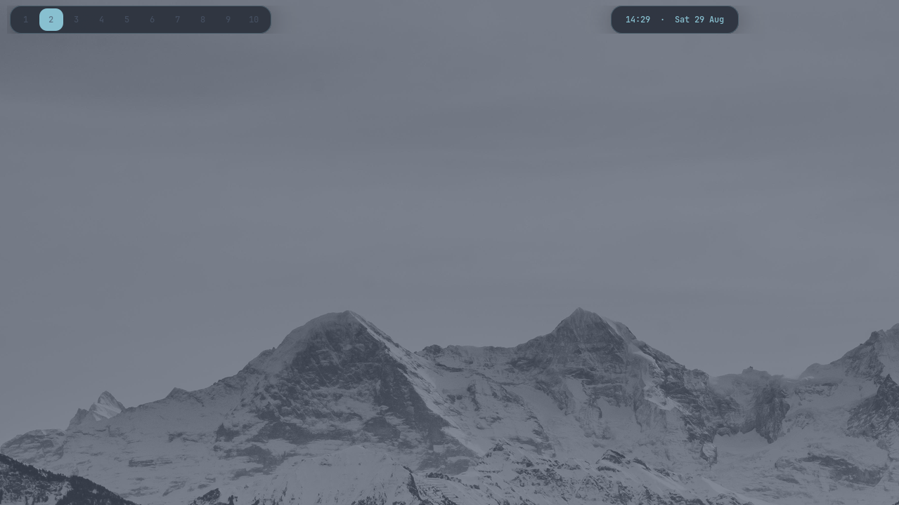

# dotfiles

Nordic Dark Hyprland configuration for Arch/CachyOS.



## Structure

```
.
├── install.sh
├── home/                    # mirrors $HOME
│   ├── .config/
│   │   ├── hypr/            # hyprland.lua, hypridle.conf, hyprlock.conf
│   │   ├── waybar/
│   │   ├── rofi/
│   │   ├── alacritty/
│   │   ├── swaync/
│   │   ├── gtk-3.0/  gtk-4.0/
│   │   ├── qt5ct/  qt6ct/  Kvantum/
│   │   ├── wlogout/
│   │   ├── Code/User/       # VSCode settings
│   │   ├── sddm.conf.d/
│   │   ├── sddm/themes/Nordic/
│   │   ├── systemd/logind.conf.d/
│   │   └── mimeapps.list
│   └── .local/bin/          # hypr-wallpaper, hypr-clipboard, hypr-screenshot
└── wallpapers/
```

## Install

```bash
cd ~/Projects/dotfiles
./install.sh
```

The script will:
1. Install packages (pacman + yay).
2. Symlink configs into `$HOME` (existing files are backed up as `.bak-<timestamp>`).
3. Copy wallpapers into `~/Pictures/wallpapers`.
4. Apply dark mode (gsettings), install the VSCode Nord theme, set the default browser.
5. Print the root steps that must be run manually (SDDM theme, logind, enable sddm, mask sleep).

Run the printed root commands, then log out and back in.

## Keybindings

| Key | Action |
|---|---|
| `Super` | Rofi launcher |
| `Super + W` | Brave Origin |
| `Super + Q` | Close window |
| `Super + T` / `Super + Enter` | Alacritty |
| `Super + C` | VSCode |
| `Super + F` | Fullscreen |
| `Super + V` | Clipboard history |
| `Super + N` | Notification center |
| `Super + E` | Thunar |
| `Super + L` | Lock screen |
| `Super + M` | Wlogout |
| `Super + Shift + S` | Screenshot region (clipboard) |
| `Super + Shift + W` | Change wallpaper (random) |
| `Super + Shift + G` | Pick wallpaper (rofi) |
| `Super + 1..9,0` | Switch workspace |
| `Super + Alt + 1..9,0` | Move window to workspace |
| `Super + Shift + 1..9,0` | Move window to workspace |
| `Super + Left/Right` | Previous/next workspace |
| `Super + Mouse wheel` | Next/previous workspace |

## Dependencies

- Hyprland, Waybar, Rofi, SwayNC, Alacritty, Wlogout
- `awww` (wallpaper backend, replaces `swww`)
- Grim/Slurp + ffplay (ffmpeg) + ImageMagick (frozen-region screenshots)
- wl-clipboard/cliphist
- Thunar + plugins (archive, volman, media-tags, gvfs-mtp, file-roller)
- Nordic GTK/Qt theme, Papirus-Dark icons, JetBrainsMono Nerd Font
- SDDM + Qt5 QML (`qt5-declarative`)
- `gnome-keyring`, `fcitx5` (+ gtk/qt), `brave-origin-bin`, `visual-studio-code-bin` (AUR)
